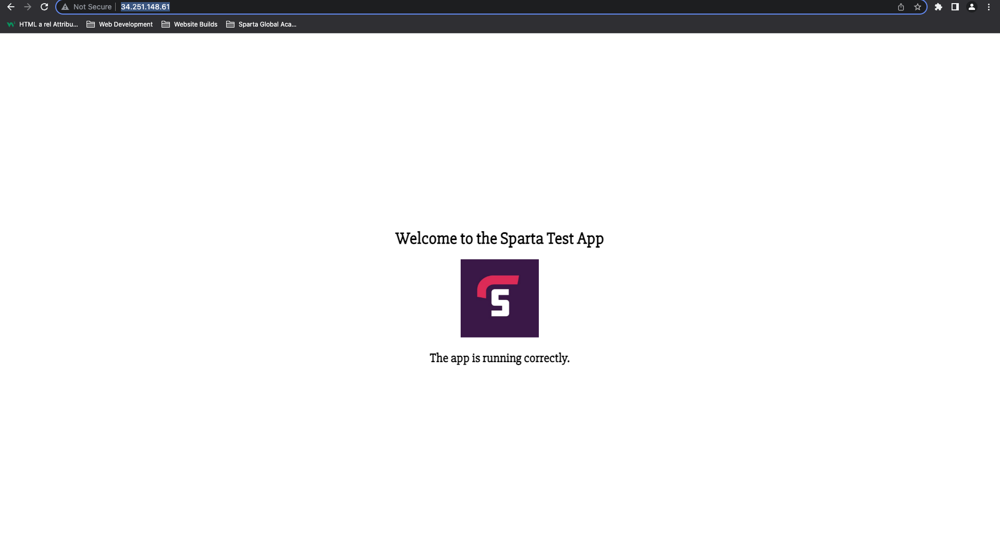

# Local Files To EC2 & Deploy App

## App Instance

1. Launch a new instance. If you have an AMI set up already, then launch it through that.

2. Name your instance to help you remember what the instance is for.

    

3. Select your instance type and key pair. If you don't have a key pair, you can create a new one.

    

4. Under network settings, select an existing security group. If you don't have one, you can create a security group. Make sure port 3000 is open and type should be Custom TCP.

    

5. Uder the advance details tab, scroll down to user data and enter your provisioning shell script to automate tasks.

6. Now launch your new instance and you will see this if launched correctly.

    

7. Select your instance you just launced and click connect.

    

8. Copy your ssh key

    

9. Open your terminal/bash window and change directory into your `.ssh` folder where your `.pem` file is stored.

10. Paste your ssh key into the terminal window and press enter. Type y to confirm.

11. Run the command `sudo apt update -y` to download any updates for your instane.

12. Run the command `sudo apt upgrade -y` to install the updates you just downloaded onto the instance.

13. Run the command `sudo apt install nginx -y` to install nginx.

14. Run the command `sudo systemctl status nginx` to make sure nginx is active and running.

14. Open another terminal and change directory into `.ssh` folder where your pem file is stored.

15. Run the command below to secure copy your app folder onto your instance.

    ```
    scp -i "tech221.pem" -r /Users/samuelnaiwo/Documents/tech221/virtualisation/app ubuntu@ec2-34-255-121-128.eu-west-1.compute.amazonaws.com:/home/ubuntu/

    ```

16. Go back to your ubuntu terminal and install NodeJs.

    ```
    sudo apt-get install python-software-properties
    curl -sL https://deb.nodesource.com/setup_12.x | sudo -E bash -
    sudo apt-get install nodejs -y
    ```

17.  Next, install pm2 with the command `sudo npm install pm2 -g`

18. Run the command `node app.js` to run the app.

## Reverse Proxy

1. Open your ubuntu terminal window.

2. Use the command `cd /etc/nginx/sites-available` in order to navigate inside the nginx configuration folder.

3. Create a new configuration file using the following command: `sudo nano nodeapp.conf`.

4. Inside the file type the following code:

```
server {
   listen 80;
   server_name 192.168.10.100;

   location / {
       proxy_pass http://192.168.10.100:3000;
       proxy_set_header Host $host;
       proxy_set_header X-Real-IP $remote_addr;
       proxy_set_header X-Forwarded-For $proxy_add_x_forwarded_for;
       proxy_set_header X-Forwarded-Proto $scheme;
   }
}
```

`server_name ***`  - can be the name of your server or your ip address.

5. Use ctrl+x to exit nano, then press y to save the changes, and then press enter to save the name of the file.

6. Enable the configuration by creating a symbolic link to enable a new config file: `sudo ln -s /etc/nginx/sites-available/nodeapp.conf /etc/nginx/sites-enabled/nodeapp.conf`.

7. Check configuration for errors: `sudo nginx -t`.

8. Now reload nginx for the new configuration to take place. `sudo systemctl reload nginx`.

9. Go back to your home folder by using `cd` command and then navigate in to `cd app`.

10. Launch app by using the command: `node app.js` 

11. Paste your ip, without port number, into browser and check if it works:

    

## DB Instance

1. Create a new instance for Mongo DB.

2. Create a new security group for this instance allowing MY IP on port 22, Custom TCP on port 27017 and Custom TCP on port 3000.

3. Launch your new instance.

4. Open new terminal and ssh into .ssh folder.

5. Copy your ssh key on AWS and paste into terminal.

6. Follow these commands to install Mongo DB

    ```
    sudo apt update -y

    sudo apt upgrade -y

    sudo apt-key adv --keyserver hkp://keyserver.ubuntu.com:80 --recv D68FA50FEA312927

    echo "deb https://repo.mongodb.org/apt/ubuntu xenial/mongodb-org/3.2 multiverse" | sudo tee /etc/apt/sources.list.d/mongodb-org-3.2.list

    sudo apt update -y

    sudo apt upgrade -y

    sudo apt-get install -y mongodb-org=3.2.20 mongodb-org-server=3.2.20 mongodb-org-shell=3.2.20 mongodb-org-mongos=3.2.20 mongodb-org-tools=3.2.20

    sudo systemctl start mongod

    sudo systemctl status mongod
    ```

5. Change directory into etc folder for MongoDB `cd /etc/`

6. Open the mongod configuration file with: `sudo nano /etc/mongod.conf`

7. Scroll down, change bindip to `0.0.0.0`

8. Save file by pressing ctrl+x to exit, then y to save changes, and then enter to confirm.

9. Restart MongoDB `sudo systemctl restart mongod`

10. Enable MongoDB `sudo systemctl enable mongod`

11. Check to see if MongoDB is active and running `sudo systemctl status mongod`

## Connect App and DB Instance

1. Open app instace and cd into home folder.

2. Open your .bashrc folder with `sudo nano .bashrc`

3. Scroll down to the bottom of the file and enter your new environment variable.

```
export DB_HOST=mongodb://<pubic IP>:27017/posts
```

4. Referesh your .bashrc folder `source .bashrc`

5. Change directory into app folder.

6. Seed the data to database with `node seeds/seed.js`

7. Run the app `node app.js`

    